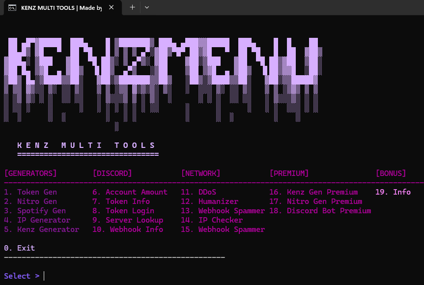

# 🔥 KENZ MULTI TOOLS



## 🎥 DEMO


## 🚀 FEATURES
- ✅ Token Generator
- ✅ Nitro Generator  
- ✅ Spotify Generator
- ✅ IP Generator
- ✅ Kenz Generator
- ✅ Account Manager
- ✅ Token Info & Login
- ✅ Server Lookup
- ✅ Webhook Tools
- ✅ IP Checker
- ✅ Premium Generators
- ✅ Discord Bot Tools

## 📦 INSTALLATION
```bash
pip install -r requirements.txt
python kenz.py

🛠️ QUICK START

git clone https://github.com/KenzCybSec/KenzMultiTools
cd KenzMultiTools
pip install -r requirements.txt
python kenz.py

💻 TESTED ON
✅ Windows 10

✅ Windows 11

✅ Windows Server

📁 FILES
kenz.py
requirements.txt
data/ (all tools)
images/
videos/
LICENSE
README.md

📞 DISCORD
https://discord.gg/amGTb4WT

⚠️ DISCLAIMER


**READ BEFORE USE:**

This tool (**Kenz Multi Tools**) is for **EDUCATIONAL PURPOSES ONLY**. 

### 🚨 IMPORTANT:
- **FOR EDUCATION**: Designed to teach cybersecurity concepts in controlled environments
- **NO ILLEGAL USE**: Do not use for unauthorized access, harassment, or any illegal activities
- **YOUR RESPONSIBILITY**: You are solely responsible for how you use this tool
- **USE LEGALLY**: Only test on systems you own or have explicit permission to test
- **COMPLY WITH LAWS**: Follow all applicable laws and platform Terms of Service

**The developer is NOT responsible for any misuse. Use at your own risk and act legally.**

*By using this tool, you agree to these terms.*

📜 LICENSE
MIT License